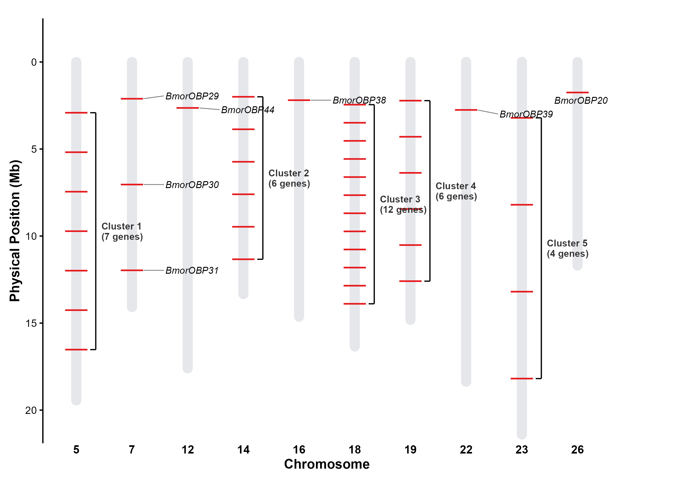

# OBP Gene Family: Genomic Localisation & Visualisation

Course project for **Biological Omics & Big Data** — genome-wide
identification and chromosomal mapping of odorant-binding protein (OBP)
genes in the silkworm (*Bombyx mori*).

An OBP gene family dataset is visualised as a publication-quality
chromosome ideogram: genes are positioned along each chromosome, clusters
are annotated with brackets, and isolated genes are labelled.

## Project Goals

1. **Data integration** — parse gene family annotations and chromosome
   length references into a unified plotting data structure
2. **Cluster detection** — algorithmically identify gene-dense chromosomes
   (≥ 4 genes) as putative tandem clusters
3. **Publication-quality visualisation** — produce a chromosome ideogram
   conforming to SCI journal figure standards (vector PDF, 300 DPI)
4. **Reproducibility** — self-contained script with no interactive
   prompts; runs from `source()` in a clean R session

## Repository Structure

```
.
├── OBP_location.R                    # Main analysis script
├── data/
│   ├── obp_locations.txt             # Gene chromosomal positions
│   ├── BMSK_chr_lengths.txt          # Chromosome length reference
│   ├── obp_family.csv                # Gene family annotation (supplementary)
│   ├── obp_positions.txt             # Detailed positions (supplementary)
│   └── obp_detailed_positions.txt    # Extended metadata (supplementary)
├── figures/
│   ├── OBP_Genomic_Locations_SCI_Style.pdf   # Vector output (journal-ready)
│   └── OBP_Genomic_Locations_SCI_Style.png   # Raster preview
├── README.md
└── .gitignore
```

## Dependencies

| Package   | Repository | Purpose                        |
|-----------|-----------|--------------------------------|
| ggplot2   | CRAN      | Grammar-of-graphics plotting   |
| dplyr     | CRAN      | Data manipulation              |
| ggrepel   | CRAN      | Non-overlapping text labels    |

### Install

```r
install.packages(c("ggplot2", "dplyr", "ggrepel"))
```

## Quick Start

1. **Clone the repository**
   ```bash
   git clone https://github.com/songyuan-he/OBP-gene-family-analysis.git
   cd OBP-gene-family-analysis
   ```

2. **Run the analysis** in R or RStudio:
   ```r
   source("OBP_location.R")
   ```

   The script reads input from `data/` and writes figures to `figures/`.
   No interactive file selection is required.

3. **Output** appears in `figures/`:
   - `OBP_Genomic_Locations_SCI_Style.pdf` — vector, 10 × 7 inches, 300 DPI
   - `OBP_Genomic_Locations_SCI_Style.png` — raster, same dimensions

## Expected Output



| Element               | Visual Encoding                                    |
|-----------------------|----------------------------------------------------|
| Chromosome backbone   | Light grey rounded bar                             |
| Gene position         | Red tick mark per gene                             |
| Gene clusters (≥ 4)   | Black bracket + bold "Cluster N (X genes)" label   |
| Isolated genes        | Italicised gene name via ggrepel, grey leader line |
| Y-axis                | Physical position in megabases (Mb)                |
| X-axis                | Chromosome labels                                  |

## Notes

- This analysis was developed as coursework for **Biological Omics &
  Big Data** and demonstrates competency in genomic data visualisation
  with R/ggplot2.
- The script is designed for reproducibility: update `DATA_DIR` and
  `FIG_DIR` at the top if your directory layout differs.
- Figure styling follows SCI journal conventions: clean axis labels,
  no unnecessary gridlines, muted background colours.

## License

This project is for educational and portfolio demonstration purposes.
